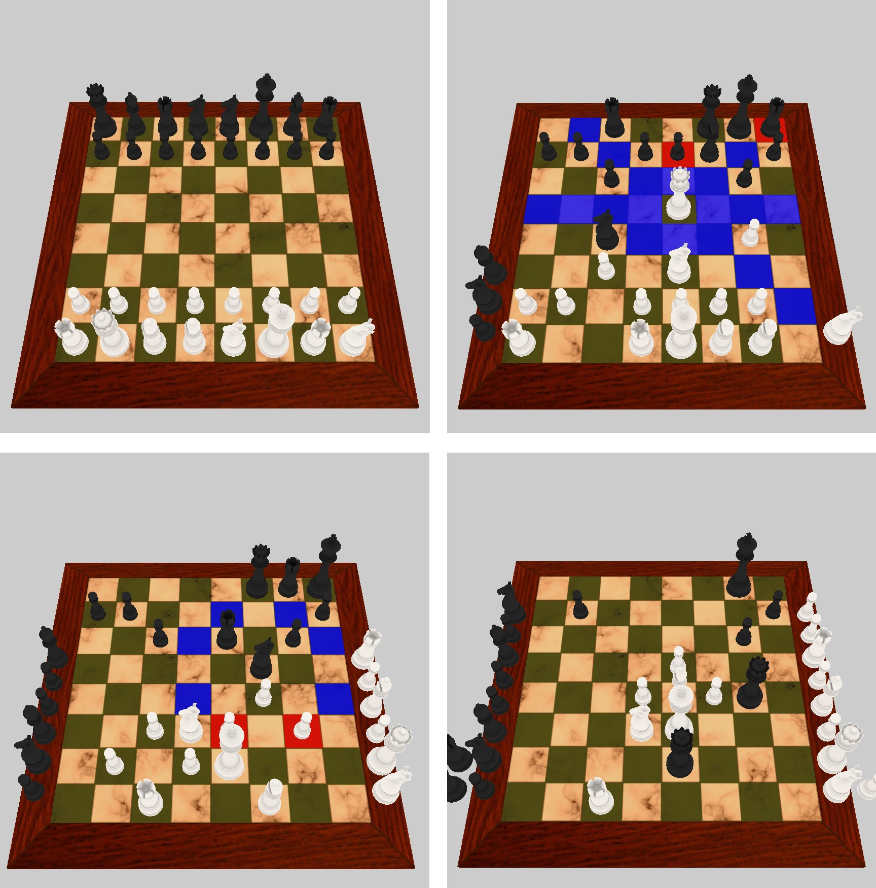

# Fischer Random Chess



### Dependencies
- A compiler with at least C++11 support.
- Freeglut3 (Opensource version of GLUT).
- GLEW (GL extensions wrangler library).
- Assimp model loader.
- SOIL image loader.


### Linux install commands for each dependency
```
//Universe repo needed for SOIL and Assimp installations
sudo apt-add repository universe
sudo apt-get update

sudo apt-get install freeglut3-dev
sudo apt-get install libglew1.6-dev
sudo apt-get install libassimp-dev
sudo apt-get install libsoil-dev
```

### Compiling the program

- Using makefile:
```
make
```
- Without using makefile:
```
g++ main.cpp pieces.cpp textfile.cpp loaders.cpp -lGL -lGLU -lglut -lGLEW -lassimp -lSOIL -w -std=c++11 -o RandomChess
```


### Controls

|Control|Purpose|
|:-:|:-:|
|1 | Start new game of Orthodox Chess |
|2 | Start new game of Fischer Random Chess |
|3 | Start new game of Double Fischer Random Chess |
| Mouse Click | Select, deselect and move pieces |
|LEFT | Castle the king with the left rook |
|RIGHT | Castle the king with the right rook |
